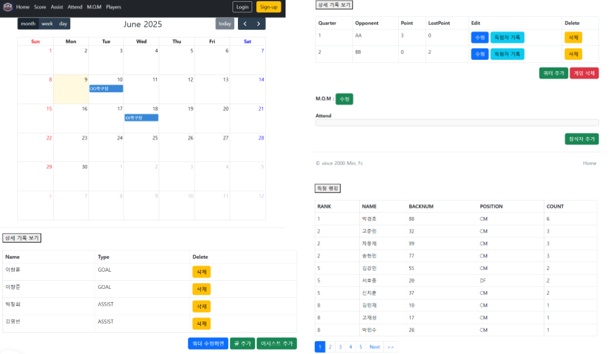
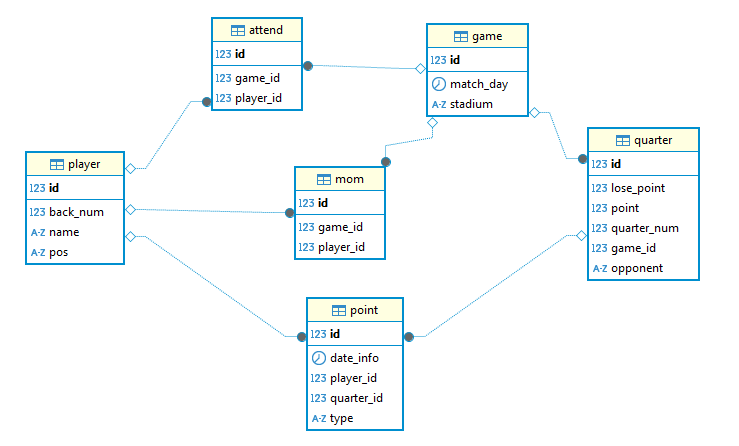

# 미르 🐉

## 조기 축구 경기 기록 웹 서비스 ⚽

 개인 사이드 프로젝트로 조기축구팀에서 사용할 수 있는 경기 기록 서비스다.

 조기축구 팀에서 경기, 득점자, 어시스트, 참석자들의 기록을 엑셀을 이용해 일일이 수작업을 하는 것을 알게 되었다.
이 작업을 간단한 ui가 있는 화면으로 하게 되면 더 쉽게 할 수 있을 것이라고 생각했고, 백엔드 개발자가 프론트엔드의 지식을 쌓기에 좋은 기회라고 생각되어 개발하게 되었다.

[//]: # (## 배포)

## 주요 기능 🔨

* 달력 위에 경기 일정 입력
* 경기 일정을 누르면 쿼터별 상대와 득점, 실점, MOM(Man Of the Match) 기록 가능
* 쿼터별 득점, 어시스트 기록
* 득점, 어시스트, 참석자 랭킹 확인 가능
* 선수 관리 페이지로 선수별 정보 조회, 수정 가능

## ERD 이미지 📜

## 계획 📒
* docker를 활용한 배포
* spring-security를 활용하여 관리자만 데이터 수정 가능하도록 개발
* 실제 조기 축구 팀에서 기록관리 할 수 있도록 도입

## UI이미지 🖼️

홈 화면 

 

게임 상세 화면 

 

쿼터별 득점 기록 화면 

 

랭킹 화면 

 

선수 관리 화면 

 

## 스택 📚

